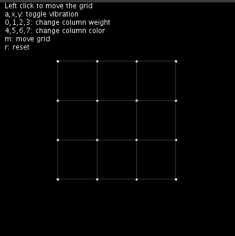
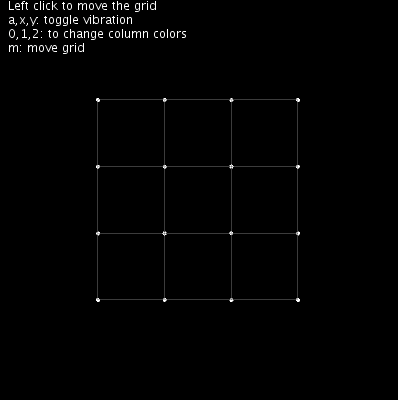
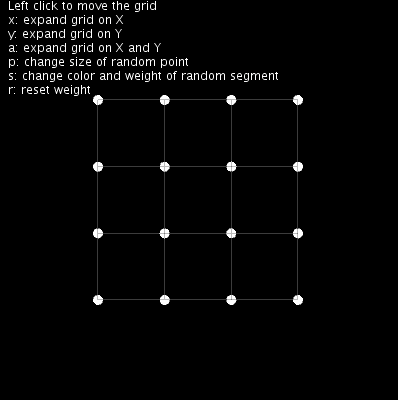
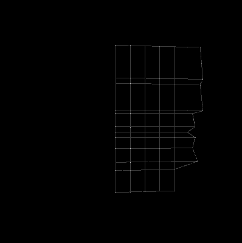

([English version](README.md))

#  Libreria para Processing 3 implementando una grilla de puntos


La idea de esta librería surgió luego de ver el video [Build the Cities](https://vimeo.com/121096680) de Raven Kwok y de la motivación para aprender mas de Processing


## Ejemplo:

```
import ktxo.art.processing.*;
Grid g1;

void setup() {
  size(400, 400, P3D);
  g1 = new Grid(this, 4, 4, 200, 200);
  g1.move(new PVector(100, 100));
  g1.dump(false);
}


void draw() {
  background(0);
  g1.display();
}

```

Ver tambien [examples](examples)










## Instalacion

1. Descargar la ultima version de [Releases](https://github.com/ktxoarts/processing_GridLibrary/releases)
2. Agregar la libreria al IDE de Processing siguiendo las intrucciones de [How to Install a Contributed Library](https://github.com/processing/processing/wiki/How-to-Install-a-Contributed-Library)