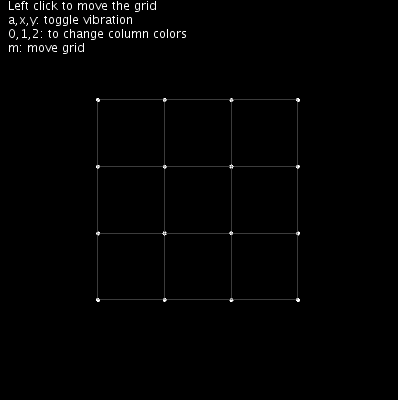

([Version en Castellano](README-ES.md))

#  Grid of Points Library for Processing 3 

This idea/project came  after having watch  the video [Build the Cities](https://vimeo.com/121096680) from Raven Kwok, and the motivation to learn more about Processing


## Example:

```
import ktxo.art.processing.*;
Grid g1;

void setup() {
  size(400, 400, P3D);
  g1 = new Grid(this, 4, 4, 200, 200);
  g1.move(new PVector(100, 100));
  g1.dump(false);
}


void draw() {
  background(0);
  g1.display();
}

```

See also [examples](examples)





## Installation

1. Download latest version from [Releases](https://github.com/ktxoarts/processing_GridLibrary/releases)
2. Add the library to Processing, see [How to Install a Contributed Library](https://github.com/processing/processing/wiki/How-to-Install-a-Contributed-Library)
